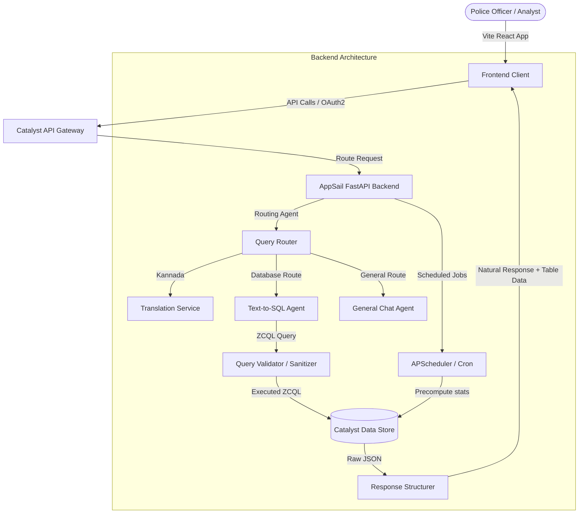

# PRISM: Police Record Information & Security Management System

PRISM is a state-of-the-art, industrial-grade AI-powered intelligence analytics and decision-support portal built for the Karnataka Police FIR database. The platform integrates a multi-agent AI chat assistant, dynamic geospatial hotspot mapping, temporal crime forecasting, and a graph-based criminal network explorer to enable law enforcement agencies to translate raw records into actionable crime-fighting intelligence.

---

## 🚀 Key Features

*   **💬 Intelligence Chat Assistant (English & Kannada)**
    *   **Indic Translation**: Translates queries in Kannada script or transliterated "Manglish" (e.g. `bengalurinalli eshtu case ide?`) to refined English before processing.
    *   **Text-to-SQL Agent**: Converts conversational questions into secure, optimized ZCQL database queries. Automatically prevents SQL injection and applies strict validation.
    *   **Dynamic UI Rendering**: Automatically maps arbitrary SQL results (counts, grouped summaries, or full rows) into responsive, dynamic data tables on the fly.
    *   **General & Conversational Agent**: Handles non-database context, help inquiries, and general system tutorials seamlessly.
*   **📊 Command & Analytics Dashboard**
    *   Interactive geospatial distribution of crimes using SVG maps.
    *   Key performance metrics (total FIRs, active investigations, high-risk offenders, active alerts).
    *   Spike detection and auto-alert engine with chronological tracking.
*   **📍 Advanced Analytics Hub**
    *   **Geospatial Hotspots**: Heatmap clusters generated using density-based spatial clustering (DBSCAN).
    *   **Crime Forecasting**: Time-series predictive forecasting using Meta's Prophet model.
    *   **Offender Risk Board**: Multi-dimensional risk scoring algorithm identifying high-rate recidivists.
*   **🕸️ Criminal Network Explorer**
    *   D3.js force-directed graph rendering criminal associations.
    *   Community detection (Louvain modularity) and centrality algorithms (degree and betweenness) to map gang clusters and locate key ringleaders.

---

## 🛠️ Architecture & Tech Stack



### Infrastructure Layer (Zoho Catalyst)
*   **AppSail**: OCI/Docker container hosting the FastAPI server.
*   **API Gateway**: Secure traffic routing, CORS enforcement, and request throttling.
*   **Data Store**: Cloud relational database powering transactional crime tables.
*   **Cache**: Redis-backed segment for fast storage of session histories, KPI stats, and query results.
*   **Cron**: Runs daily jobs to recompute forecasts, risk metrics, and detect spikes.

---

## 📁 Repository Overview

A detailed layout of all components can be found in the [project-structure.md](file:///d:/STUDY/PROJECTS/prism/project-structure.md) file. A summary:

```
prism/
├── frontend/             # React + TypeScript SPA client (CRA)
├── backend/              # FastAPI Python backend (Catalyst AppSail deployment)
├── implementations/      # Markdown feature specifications & architecture plans
├── resources/            # Local copies of Catalyst SDK & ZCQL documentation
├── services-used.md      # Consolidated list of Zoho Catalyst services used
└── project-structure.md  # Comprehensive project directory tree reference
```

---

## ⚙️ Quick Start & Installation

### Prerequisites
*   [Node.js](https://nodejs.org/) v18+ & npm v9+
*   [Python](https://www.python.org/) v3.10+ & [uv](https://github.com/astral-sh/uv) (recommended package manager)
*   [Zoho Catalyst CLI](https://catalyst.zoho.com/help/tutorials/command-line-interface.html) (if deploying cloud resources)

### 1. Backend Setup
1. Navigate to the backend directory:
   ```bash
   cd backend
   ```
2. Create and activate a virtual environment (using `uv` or standard `venv`):
   ```bash
   uv venv
   # On Windows:
   .venv\Scripts\activate
   # On macOS/Linux:
   source .venv/bin/activate
   ```
3. Install dependencies:
   ```bash
   uv pip install -r pyproject.toml
   ```
4. Copy the environment template and fill in your Zoho Catalyst OAuth credentials:
   ```bash
   cp .env.example .env
   ```
5. Run the FastAPI development server:
   ```bash
   uvicorn main:app --host 0.0.0.0 --port 3001 --reload
   ```

> 💡 *Refer to [backend/README.md](file:///d:/STUDY/PROJECTS/prism/backend/README.md) for detailed credentials setup.*

### 2. Frontend Setup
1. Navigate to the frontend directory:
   ```bash
   cd ../frontend
   ```
2. Install client dependencies:
   ```bash
   npm install
   ```
3. Start the Vite/CRA React development server:
   ```bash
   npm start
   ```
4. Access the web app in your browser at `http://localhost:3000`.

> 💡 *Refer to [frontend/README.md](file:///d:/STUDY/PROJECTS/prism/frontend/README.md) for more interface configuration details.*

---

## 📦 Deployment Workflow

To deploy the service to your active Zoho Catalyst environment:

1. Authenticate with Catalyst:
   ```bash
   catalyst login
   ```
2. Initialize or verify your project directory:
   ```bash
   catalyst project:use
   ```
3. Deploy both client and backend functions:
   ```bash
   catalyst deploy
   ```